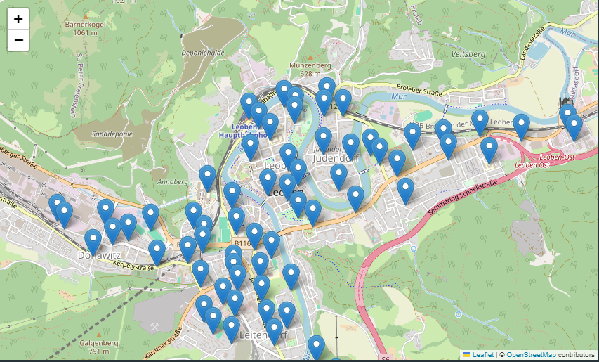
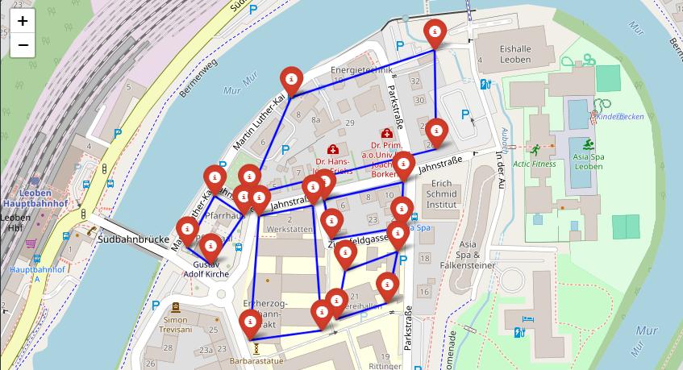
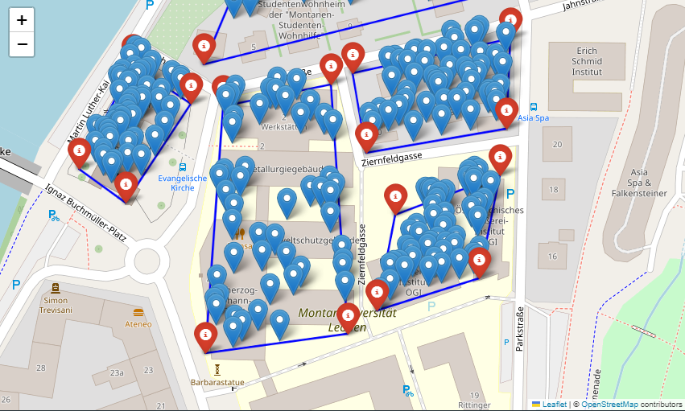

# Maps Folder

This folder contains Jupyter notebooks related to map visualization for the ATM placement project.

## Files

- **atm_map.ipynb** - A Jupyter Notebook that generates an interactive map with ATM locations using Folium.
- **user_map.ipynb** - A notebook that visualizes user locations and their coverage areas.

## Usage

1. Open `atm_map.ipynb` or `user_map.ipynb` in Jupyter Notebook or Jupyter Lab.
2. Run all cells to generate the respective maps.
3. The output is displayed in jupyter notebook.

## Images
Below are sample images generated from the notebooks:

**ATM Locations:** 

**Users living bounds:** 

**Generated Users:** 

---

*This README provides an overview of the map visualizations in this project.*

